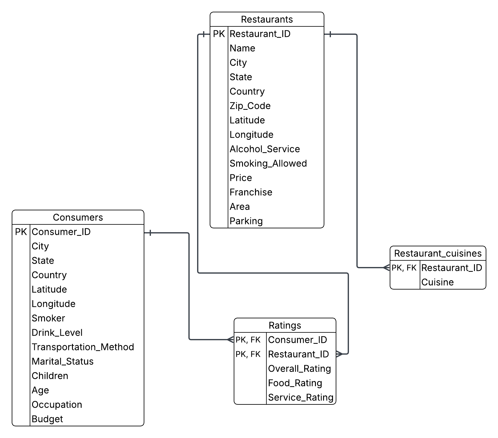

# Foodservice Database Project

This project demonstrates database design, data import, SQL querying and stored procedure development using SQL Server.

The database was created from four CSV files and includes restaurants, consumers, ratings and cuisine information.

The project showcases:
- Database design
- Primary and foreign key implementation
- SQL joins
- Nested queries
- Aggregation functions
- Stored procedures
- Business analysis using SQL

## Database Schema

## Technologies Used

- SQL Server
- SQL Server Management Studio (SSMS)
- T-SQL
- GitHub

## Key Analysis

1. Restaurants with medium price, open area and Mexican cuisine.
2. Comparison of Mexican and Italian restaurants with an overall rating of 1.
3. Average age of consumers giving a service rating of 0.
4. Restaurants rated by the youngest consumer.
5. Stored procedure for updating service ratings based on parking availability.

## Project Structure

- sql/: Database creation scripts, queries and stored procedures.
- report/: Project report.
- images/: ERD and query outputs.
- dataset/: Source CSV files.
